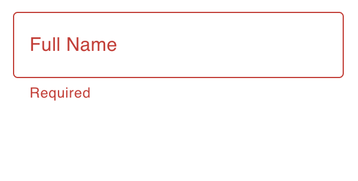
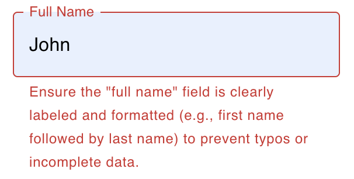

# FormBuddy

**FormBuddy** is an intelligent layer on top of [React Hook Form](https://react-hook-form.com/) that makes form filling smarter, friendlier, and more error-resistant — all on the client-side.

Powered by a hybrid of in-browser machine learning and generative AI, FormBuddy actively:
- Predicts common user errors
- Explains vague or incomplete inputs
- Guides users to submit clear, actionable data

(Old) Static Errors        |  (New) Dynamic Errors
:-------------------------:|:-------------------------:
         |  


## Why FormBuddy?

Form validation is no longer just about red borders and `"This field is required."`

**FormBuddy goes further:**
- Predicts likely mistakes before validation
- Uses a lightweight ML model trained on real-world errors
- Integrates a small language model (LLM) to clarify and rephrase inputs
- Built directly on `react-hook-form`, so it’s composable and idiomatic for React


## In-Browser Inference: ML + Gen AI

Modern browsers are surprisingly powerful. FormBuddy proves it by running both:

| Model Type | Technology | Purpose |
|------------|------------|---------|
| ML Classifier | TensorFlow.js or ONNX.js | Predicts missing or error-prone fields |
| LLM (TinyLlama, Qwen3-1.7B, etc.) | WebLLM / Transformers.js / WASM+GGUF | Expands vague text, offers natural language guidance |


## Features

- **React Hook Form** for standard form management and validation
- **Predictive Validation** using a lightweight TensorFlow.js model
- **Field Explanation** powered by a mocked WebLLM client with reusable prompt templates
- **Memory Aware** – the LLM features are automatically disabled on devices with low memory (use `VITE_LOW_MEMORY=true` in development to simulate) and fall back to static hints
- **WebLLM Support** – set `VITE_USE_WEBLLM=true` to enable WebLLM. The model can
  be changed with `VITE_WEBLLM_MODEL_ID` if you want to load a different
  prebuilt model. By default it uses a TinyLlama variant.
- **Debug Logging** – set `VITE_LOG_MODEL_IO=true` to print ML and LLM inputs and outputs to the console

## Using FormBuddy

1. **Identify your form.** Determine the form description and list of fields. For a bug report form we use:

   ```ts
   const FORM_DESCRIPTION = 'Bug report submission form for an application. It collects user feedback on bugs, features, and UI issues.'
   const FIELDS: FieldDetail[] = [
      { name: 'fullName', description: 'full name' },
      { name: 'email', description: 'contact email address' },
      { name: 'feedbackType', description: 'Bug, Feature or UI Issue' },
      { name: 'version', description: 'application version number' },
      { name: 'steps', description: 'steps to reproduce the problem' },
      { name: 'expected', description: 'expected behaviour of the application' },
      { name: 'actual', description: 'actual behaviour observed' },
    ]
   ```

2. **Create labelled data.** A small synthetic dataset is generated with `training/generate_synthetic_data.py` and looks like:

   ```json
   {
     "fullName": "Hannah Stevens",
     "email": "rebecca75@example.org",
     "feedbackType": "UI Issue",
     "appVersion": "v1",
     "stepsToReproduce": "",
     "expectedBehavior": "",
     "actualBehavior": "",
     "screenshotProvided": false,
     "label": "incomplete",
     "errors": {
       "fullName": "ok",
       "email": "ok",
       "appVersion": "invalid",
       "stepsToReproduce": "missing",
       "expectedBehavior": "missing",
       "actualBehavior": "missing"
     }
   }
   ```

   The full dataset is saved to `training/bug_reports_data.json` and is used to train the classifier.

3. **Train the classifier.** Run `python training/train_model.py` to produce an ONNX model. The script reads the dataset, trains a logistic regression pipeline and writes `bug_report_classifier.onnx` to `packages/example/public/models`.

4. **Define system prompts.** Prompts are generated dynamically based on form description, field description and the ML error type. The example application defines a helper:

   ```ts
   const getPrompt = (
      form: string,
      field: string,
      error: string,
    ) => {
      const base = `You are assisting with the "${form}" form.`
      switch (error) {
        case 'missing':
          return `${base} The user left the "${field}" field empty. Explain in one sentence what information should be provided.`
        case 'invalid':
          return `${base} The value for "${field}" looks invalid. Give a brief example of a valid entry.`
        case 'too short':
          return `${base} The input in "${field}" is too short. Suggest how to make it more descriptive.`
        default:
          return defaultPromptGenerator(form, field, error)
      }
    }
   ```

5. **Use the hook.** Call `useFormBuddy` inside your form component:

   ```tsx
   const { handleBlur } = useFormBuddy(FORM_DESCRIPTION, FIELDS, getPrompt, {
     validationModelName: 'bug_report_classifier.onnx',
     llmModelName: import.meta.env.VITE_WEBLLM_MODEL_ID,
     errorTypes: ['missing', 'too short', 'ok'],
   })
   ```


## Training the ML model

The repository includes a small Python script that trains a text
classifier on the synthetic bug report dataset and exports it to ONNX
format. Each row of the dataset now contains per-field error labels so
the model can predict issues for individual inputs. The resulting file
is placed in `packages/example/public/models` and can be loaded by the predictive
validation hook.

1. Install the change to training directory:

```bash
cd training
```

2. Create a virtual environment

```bash
python -m venv venv
. venv/bin/activate
```

3. Next Install the Python requirements:

```bash
pip install -r requirements.txt
```

4. Then run the training script:

```bash
python train_model.py
```

## Testing

Run the example project locally with:

```bash
npm install
npm --workspace packages/example run dev
```

Open `http://localhost:5173` to try it out.

To verify the service worker and production build, run:

```bash
npm --workspace packages/example run build
npm --workspace packages/example run preview
```

## Project Structure

This repo uses **npm workspaces**.

- `packages/form-buddy` – reusable hooks and agents
- `packages/form-buddy/src/hooks/useFormBuddy.ts` – main helper hook
- `packages/form-buddy/src/lib/classifier.ts` – placeholder ML implementation
- `packages/form-buddy/src/lib/llm.ts` – mock LLM client
---
- `packages/example` – demo application
- `packages/example/src/components/BugReportForm.tsx` – example form component
- `packages/example/public/models` – place to store local model files
---
- `training/generate_synthetic_data.py` – script to generate synthetic bug report data for training
- `training/train_model.py` – script to train the bug report classifier and export ONNX model
- `training/requirements.txt` – Python dependencies for training scripts

## License

MIT License. Feel free to fork and adapt!

> Built with ❤️ to show just how far the modern browser has come — ML, LLMs, and empathy, all without leaving the tab.